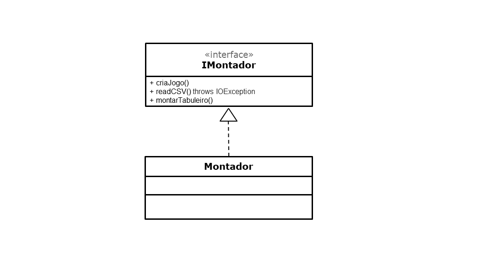

# Projeto `POO-BEE Game`

# Estrutura de Arquivos e Pastas

~~~
├── README.md          <- apresentação do projeto
│
├── data               <- dados usados pelo jogo (se houver)
│
├── notebooks          <- Jupyter notebooks ou equivalentes
│
├── src                <- projeto em Java (preferencialmente projeto no Eclipse)
│   │
│   ├── src            <- arquivos-fonte do projeto (.java)
│   │
│   ├── bin            <- arquivos em bytecode (.class)
│   │
│   └── README.md      <- instruções básicas de instalação/execução
│
└── assets             <- mídias usadas no projeto
~~~

# Descrição Resumida do Projeto/Jogo

> O jogo POO-BEE-Game é baseado nos moldes do tradicional Pacman. Tal jogo consiste
em um personagem que é controlado pelo teclado por um usuário, que tem o objetivo de capturar todas as
pastilhas do mapa e, assim, conseguir vencer. Durante o caminho, há fantasmas que fazem movimentos
específicos para tentar matar o pacman e fazer com que o jogador perca o jogo. No caso do jogo POO-BEE-Game,
o jogador controla um urso, que tem o objetivo de pegar todos os potes de mel do cenário, fugindo das abelhas
mutantes que tentam o matar. Há, também, elementos que modificam a dinâmica do jogo. Por exemplo, a flor, quando capturada pelo
Urso, faz o jogador ganhar muitos pontos, por outro lado, leva as abelhas a se movimentarem mais rapidamente em direção ao Urso, devido
ao cheiro exalado. Há, também, a raquete de matar insetos, que ao ser pega, faz com que o urso fique bolado e possa matar as abelhas
que estão tentando o atrapalhar em seu objetivo.

> Para executar o jogo basta clonar o repositório do git e clicar no arquivo AppPOO-BEE-Game.jar e selecionar a dificuldade
que deseja jogar. Caso esse método não funcione, entre no caminho: poo-bee-game/src/bin e dentro dessa pasta bin abra o terminal
que tenha o java instalado em sua máquina e digite o seguinte comando: `java Main.AppPacman`, dessa forma, pode-se escolher a 
dificuldade e jogar o jogo. Há também a possibilidade de abrir o repositório no Eclipse, abrir o arquivo Main.java e rodar a aplicação,
dessa forma, pode-se rodar o jogo das três formas, sendo a mais indicada, a do terminal, que é a mais certa de que não haverá erros.

# Equipe: Não Tem Como
* `César Devens Grazioti` - `RA: 195641`
* `Cícero Pizzol Libardi` - `RA: 168810`

# Vídeos do Projeto

## Vídeo da Prévia

## Vídeo do Jogo

# Slides do Projeto

## Slides da Prévia
[Link dos slides da prévia](https://unicampbr-my.sharepoint.com/:p:/r/personal/c195641_m_unicamp_br/Documents/Pr%C3%A9via%20Pac-man%20-%20POO.pptx?d=wae4c790d8be24e2a91b3b25c6607d748&csf=1&web=1&e=FY9JLZ)

## Slides da Apresentação Final
[Link dos slides da apresentação final](https://docs.google.com/presentation/d/1TieULCng4RWGzUQP_PR5EOshnf6yBc9A12-thSbbd_k/edit#slide=id.ge25e0f6020_0_819)

## Relatório de Evolução

> Inicialmente, o grupo enfrentou muita dificuldade em como começar o projeto. De forma à pensar em todas as partes do jogo antes de produzir código, optamos pelo rumo de construir uma arquitetura consistente. Nesse contexto, submetemos construir uma arquitetura com moldes no Model-View-Control, conforme introduzido na aula "Implementação de Componentes e Interface Gráfica". Dentro de uma semana nossa equipe não estava confortável com a arquitetura imposta, uma vez que não via sentido na comunicação entre alguns componentes e não sabia como funcionaria por partes. Após comparecer em várias monitorias, conseguimos construir nosso próprio diagrama, i.e, fragmentar nosso projeto em componentes. Assim, restava lidar com a parte de comunicação entre eles. Neste ponto também apresentamos bastante dificuldade, uma vez que nenhum dos integrantes estava familiarizado com Interfaces. Após rever os vídeos sobre Fundamentos de Interfaces e estudar sobre o método connect conseguimos, de fato, chegar em um modelo que fazia sentido em nossa mente. 
> Durante a escrita do código, percebemos que os nossos Atores não podiam formar uma hierarquia de classes, dado que possuiam apenas alguns métodos get e set em comum, porém, suas dinâmicas ao longo do Labirinto eram diferentes: havíamos atores que nunca se moviam e havíamos atores que se moviam (de forma distinta). Sob esse viés, optamos por realizar uma hierarquia de interfaces, onde o Muro, o Ouro e a Cereja implementam a interface IAtorEstatico e os demais atores (Pacman e Fantasmas) implementam sua própria interface. Dessa forma, notamos que poderíamos estabeler uma interface mãe, comum a todos eles, que definiria quais as propriedades semelhantes desses atores. Além disso, como apenas os Fantasmas e o Pacman se movimentavam no labirinto, propomos que estes deveriam guardar uma referência do tabuleiro.
> Feitos tais ajustes, necessitávamos cuidar da interface gráfica. A priori, o grupo pensou em como representar a matriz labirinto de forma visual. Como sugestão dos PEDs/PADs, foi utilizado uma matriz de JLabels com layout configurado para exigir as imagens cada uma em um retângulo - GridLayout. 
> Tendo a certeza de que estávamos exibindo de forma correta nosso tabuleiro, demos prioridade à movimentação de nosso Pacman e como se daria a atualização de nosso painel. Nesse caminho, tivemos a ideia de adicionar na janela de execução do jogo um KeyListener (associado ao JFrame), para escutar a tecla pressionada e fazer a movimentação do Pacman, após a verificação de movimento válido. Caso o movimento fosse dado como válido, removemos o Pacman da posição atual, atualizamos o posição final dele no labirinto e passamos por um processo de transformação do labirinto em String até que a atualização do Painel ocorra.
> Tínhamos a ideia de perguntar o nome do jogador logo no início da tela, porém, por questões de simplificações e não impactar no enredo do jogo, optamos pedir apenas ao usuário que escolha uma dificuldade de mapa e, assim, mostraríamos no canto superior sua pontuação ao longo do jogo. A fim de deixar o projeto de uma forma mais simpática, ajustamos um tipo e tamanho de fonte para a tela inicial, bem como imagens do Urso Pooh feliz/triste caso o jogador vença/perca o jogo.

# Destaques de Código

> O trecho de código abaixo faz a adição do KeyListener do teclado à janela principal do jogo, designando quais as ações que devem ser realizadas a depender da tecla clicada pelo usuário no teclado. Tal trecho é dado pelo princípio do Pattern Observer, em que um objeto fica observando alguma ação do teclado ou mouse para que realize algum processo.

~~~java
addKeyListener(janela);
...
public void addKeyListener(Painel janela){
        janela.addKeyListener(new KeyListener() {
            ...
            public void keyPressed(KeyEvent e) {
                if(e.getKeyCode() == KeyEvent.VK_W || e.getKeyCode() == KeyEvent.VK_UP){
                    if (labirinto.ehMovimentoValido(pacman.getI() - 1, pacman.getJ())) {
                        pacman.moverAtor(-1, 0);
                        coletouOuro = pacman.verificarSala();
                        labirintoString = labirinto.labirintoToString();
                        janela.atualizarLabirinto(labirintoString, pacman.getScore());
                    }
                    ...
                }
~~~

> Performa uma ação a cada batida do timer. Ou seja, o objeto controle é observador do Timer, sendo a cada batida uma chamada de movimentação dos fantasmas do jogo. Também implementa o Pattern Observer destacado anteriormente.

~~~java
temporizador = new Timer(tempo, this);
temporizador.start();
...
public void actionPerformed(ActionEvent e) {
        for (IFantasma fant: fantasmas){
            if (fant != null){
                fant.moverAtor(pacman.getI(), pacman.getJ());
                verificacoesPosMov();
                labirintoString = labirinto.labirintoToString();
                janela.atualizarLabirinto(labirintoString, pacman.getScore());
            }
        }
    }
~~~

# Documentação dos Componentes

# Diagramas

## Diagrama Geral do Projeto

> Inicialmente, é criado um objeto do tipo Controle que, segundo sua metodologia, permite o fluxo do jogo na aplicação principal. Desse modo, o Controle instancia um objeto Montador, que por meio do contrato IMontador, oferece o serviço de criação do jogo. O objeto Montador, então, declara uma referência para um Labirinto com linhas × colunas Salas nulas, bem como para um Pacman e 4 Fantasmas, em forma de vetor. 
De acordo com a dificuldade selecionada pelo jogador, o Montador recebe do CSVHandling uma matriz de String. Para cada posição dessa matriz é instanciado um Ator, dependendo do caractere que a corresponde. Essa instância pode ser firmada pelas seguintes interfaces: IAtorEstatico, IFantasma, IPacman. Independentemente do tipo de instanciação, devemos conectar o Ator na  Sala pertencente à posição ij do labirinto, uma vez que o labirinto deve ter ciência de suas células. Essa conexão se dá por meio da interface IMontadorLabirinto.
 Caso o Ator instanciado anteriormente seja um Pacman ou um Fantasma, teremos uma conexão de via dupla, isto é, este Ator possui também uma referência para o tabuleiro - conforme acordado pela interface IConnectLabirinto. 

> Dado que a execução do jogo se dá no Controle, devemos conectar o Labirinto, o Pacman e o vetor de Fantasma (instanciados no Montador) ao devido ponteiro declarado nos atributos do objeto Controle. Quem é responsável por essas 3 conexões é a interface IRMontador.
Note que o Controle tem referência dos Fantasmas e do Pacman pois é nele que o movimento desses atores é gerenciado.
Isto é: dada uma instrução de movimentação do usuário para o Pacman, o Controle pergunta ao Labirinto se tal movimento é válido, por intermédio da interface IMovimentoValido. Em caso afirmativo, o Ator (Pacman) atualiza sua nova posição no tabuleiro, via conexão IAtualizaTabuleiro. Por conseguinte, é pedido que a interface gráfica seja atualizada, ou seja, seja mostrado estado atual do tabuleiro - serviço disponibilizado pelo componente LabirintoView e definido pela interface IAtualizaView.

## Diagrama Geral de Componentes

## Componente `Labirinto`

> Esse componente tem o papel de armazenar o tabuleiro do nosso jogo em sua clase Labirinto, que é representado por uma matriz de Salas, contendo também suas dimensões. O Labirinto também tem ciência da quantidade total de pastilhas no tabuleiro - atributo fundamental para saber se o jogador venceu o jogo - e, da existência dos Atores dados os índices correspondentes. Cada Sala é referenciada por indices i e j, equivalentes a linha e coluna no tabuleiro respectivamente, e nela pode haver uma referência para um dos Atores (Pacman, Fantasmas, Ouro, Cereja e Muro), se um ou mais deles estiverem contidos num mesmo espaço. Assim, para adicionar uma referência ou ver se ela é nula, basta acionar os métodos get e set da Sala. O mesmo é válido para as pastilhas, uma vez que ao longo da execução é necessário saber se o Pacman comeu a pastilha ou não.
> O Labirinto é responsável por receber a intenção de movimento do Pacman enviada pelo jogador, retornar se esse movimento é valido e realizar as devidas alterações em seu estado, por exemplo, a captura de um ouro/cereja/pastilha e o movimento dos fantasmas/pacman.

**Ficha Técnica**
item | detalhamento
----- | -----
Classe | `src.Labirinto`
Autores | `César Devens Grazioti` e `Cícero Pizzol Libardi`
Interfaces | `IMontadorLabirinto`, `IConnectLabirinto`, `IAtualizaLabirinto`, `IMovimentoValido`

### Interfaces

Interfaces associadas a esse componente:

Interface agregadora do componente em Java:

~~~java
public interface ILabirinto extends ILabirintoPropriedades, IAtualizaLabirinto, IMovimentoValido, IMontadorLabirinto{
}
~~~

## Detalhamento das Interfaces

### Interface `ILabirintoPropriedades`

`Fornece ferramentas para acessar e modificar estados do labirinto.`

~~~java
public interface ILabirintoPropriedades {
    public void atualizaPastilha(int i, int j, boolean condicao);
    public boolean haPastilha(int i, int j);
    public boolean haCereja(int i, int j);
    public boolean haOuro(int i, int j);
    public boolean haMuro(int i, int j);
    public String[][] labirintoToString();
    public int getQtdPastilhas();
    public void setQtdPastilhas(int qtd_pastilhas);
    public void removerPastilha(int i, int j);
}
~~~

Método | Objetivo
-------| --------
`atualizaPastilha` | `Retira ou Insere na posição ij do labirinto uma pastilha, dependendo da condição dada`
`haPastilha` | `Retorna se há uma pastilha na posição ij do labirinto`
`haCereja` | `Retorna se há uma cereja na posição ij do labirinto`
`haOuro` | `Retorna se há um ouro na posição ij do labirinto`
`haMuro` | `Retorna se há um muro na posição ij do labirinto`
`labirintoToString` | `Retorna uma matriz de Strings do estado atual do tabuleiro, respeitando as prioridades de exibição`
`getQtdPastilhas` | `Retorna a quantidade de pastilhas restantes no tabuleiro`
`setQtdPastilhas` | `Define a quantidade de pastilhas existentes no tabuleiro`
`removerPastilha` | `Altera o estado da pastilha na posição ij para falso e subtrai em 1 a quantidade total de pastilhas`

### Interface `IAtualizaLabirinto`

`Possui métodos que permitem a remoção de atores da posição ij do tabuleiro, com exceção do Muro.`

~~~java
public interface IAtualizaLabirinto {
    public void removerPacman(int i, int j);
    public void removerFantasma(int i, int j, int idx);
    public void removerCereja(int i, int j);
    public void removerOuro(int i, int j);
}
~~~

Método | Objetivo
-------| --------
`removerPacman` | `Remove o Pacman da posição ij do tabuleiro`
`removerFantasma` | `Remove o Fantasma de índice idx do vetor de fantasmas na posição ij do tabuleiro`
`removerCereja` | `Remove a Cereja da posição ij do tabuleiro`
`removerOuro` | `Remove o Ouro da posição ij do tabuleiro`

### Interface `IMovimentoValido`

`Possui um método para verificar se a intenção de movimento do Pacman ou do Fantasma é válida.`

~~~java
public interface IMovimentoValido {
    public boolean ehMovimentoValido(int iFim, int jFim);
}
~~~

Método | Objetivo
-------| --------
`ehMovimentoValido` | `Recebe os índices finais da intenção de movimento dos Atores Móveis no labirinto e retorna se tal movimento é válido ou não`

### Interface `IMontadorLabirinto`

`<Resumo do papel da interface.>`

~~~java
public interface IMontadorLabirinto {
    public void montaLabirinto(int linhas, int colunas);
    public void connect(IAtorEstatico ator, int i, int j);
    public void connect(IPacman ator, int i, int j);
    public void connect(IFantasma ator, int i ,int j, int idx);
}
~~~

Método | Objetivo
-------| --------
`montaLabirinto` | `Recebe um número inteiro de linhas e colunas e instancia um labirinto com tais dimensões`
`connect` | `Conecta um Ator à posição ij do labirinto. Dependendo dos argumentos passados na chamada de função, será chamado um método connect diferente, uma vez que há sobrecarga`

## Componente `Ator`

> <Resumo do papel do componente e serviços que ele oferece.

**Ficha Técnica**
item | detalhamento
----- | -----
Classe | `src.Ator`
Autores | `César Devens Grazioti` e `Cícero Pizzol Libardi`
Interfaces | `IAtualizaLabirinto`, `IConnectLabirinto`, `IPacman`, `IFantasma`, `IMontadorEstatico`, `IMontadorPacman`, `IMontadorFantasma`

### Interfaces

Interfaces associadas a esse componente:

Interfaces agregadoras do componente em Java:

~~~java
public interface IAtorEstatico extends IAtorPropriedades, IMontadorEstatico{
}
~~~

~~~java
public interface IFantasma extends IAtorPropriedades, IMontadorFantasma, IConnectLabirinto{
    public void moverAtor(int pacI, int pacJ);
    public void gerarMovimento(int pacI, int pacJ);
}
~~~

~~~java
public interface IPacman extends IAtorPropriedades, IMontadorPacman, IConnectLabirinto{
    public void moverAtor(int shiftI, int shiftJ);
    public int getScore();
    public boolean verificarSala();
    public boolean estaBolado();
}
~~~

## Detalhamento das Interfaces

### Interface `IMontadorEstatico`

`Monta os atores Muro, Cereja e Ouro.`

~~~java
public interface IMontadorEstatico {
    public void montaAtor(int i, int j, char caractere);
}
~~~

Método | Objetivo
-------| --------
`montaAtor` | `Dada a posição ij do Ator no labirinto e seu caractere correspondente, atribuindo tais valores aos seus atributos`

### Interface `IAtorPropriedades`

`Dispõe dos métodos get e set dos atributos comuns à todos os Atores do jogo.`

~~~java
public interface IAtorPropriedades {
    public int getI();
    public int getJ();
    public void setI(int i);
    public void setJ(int j);
    public char getChar();
    public void setChar(char caractere);
}
~~~

Método | Objetivo
-------| --------
`getI` | `Retorna o índice da linha a qual o ator está no labirinto`
`getJ` | `Retorna o índice da coluna a qual o ator está no labirinto`
`setI` | `Define o índice da linha a qual o ator está no labirinto`
`setJ` | `Define o índice da coluna a qual o ator está no labirinto`
`getChar` | `Retorna o caractere que representa o ator em nossa abstração`
`setChar` | `Define o caractere que representa o ator em nossa abstração`

### Interface `IMontadorFantasma`

`Monta os Fantasmas e define seus atributos.`

~~~java
public interface IMontadorFantasma {
    public void montaAtor(int i, int j, char caractere, int idx);
}
~~~

Método | Objetivo
-------| --------
`montaAtor` | `Dada a posição ij, o índice no vetor de fantasmas e o caractere correspondente, atribui tais valores aos atributos do Fantasma`

### Interface `IMontadorPacman`

`Monta o Pacman e define seus atributos.`

~~~java
public interface IMontadorPacman {
    public void montaAtor(int i, int j, char caractere);
}
~~~

Método | Objetivo
-------| --------
`montaAtor` | `Dada a posição ij do Pacman no labirinto e seu caractere correspondente, atribui-se tais valores aos seus atributos`

### Interface `IConnectLabirinto`

`Conecta o labirinto aos atores que se movimentam.`

~~~java
public interface IConnectLabirinto {
    public void connect(ILabirinto labirinto);
}
~~~

Método | Objetivo
-------| --------
`connect` | `Faz com que os atores que se movimentam tenham uma referência ao labirinto`

### Interface `IPacman`

`Dispõe de propriedades comuns a todos os Atores e, também, adiciona métodos particulares a esse Ator.`

~~~java
public interface IPacman extends IAtorPropriedades, IMontadorPacman, IConnectLabirinto{
    public void moverAtor(int shiftI, int shiftJ);
    public int getScore();
    public boolean verificarSala();
    public boolean estaBolado();
}
~~~

Método | Objetivo
-------| --------
`moverAtor` | `Dados os incrementos dos índices i e j do Pacman, movimenta este para a Sala desejada`
`getScore` | `Retorna a pontuação atual do jogador`
`verificarSala` | `Verifica quais elementos estão presentes na mesma Sala que o Pacman. Caso haja um Ouro, retornará true`
`estaBolado` | `Retorna se o Pacman está bolado ou não, i.e, se ele capturou uma Cereja`

### Interface `IFantasma`

`Dispõe de propriedades comuns a todos os Atores e, também, adiciona métodos particulares a esse Ator.`

~~~java
public interface IFantasma extends IAtorPropriedades, IMontadorFantasma, IConnectLabirinto{
    public void moverAtor(int pacI, int pacJ);
    public void gerarMovimento(int pacI, int pacJ);
}
~~~

Método | Objetivo
-------| --------
`moverAtor` | `Recebe as coordenadas atuais do Pacman no labirinto e movimenta os fantasmas, com base da resposta do método abaixo`
`gerarMovimento` | `Decide com base na cor os incrementos dos índices i e j de cada Fantasma`

## Componente `Controle`

> <Resumo do papel do componente e serviços que ele oferece.

**Ficha Técnica**
item | detalhamento
----- | -----
Classe | `src.Controle`
Autores | `César Devens Grazioti` e `Cícero Pizzol Libardi`
Interfaces | `IPacman`, `IFantasma`, `IMontador`, `ILabirintoView`, `IMovimentoValido`

### Interfaces

Interfaces associadas a esse componente:

Interface agregadora do componente em Java:

~~~java
public interface IControle extends IRMontador{
    public void executaJogo(String dificuldade);
}
~~~

## Detalhamento das Interfaces

### Interface `IRMontador`

`Conectar os objetos criados no Montador ao objeto Controle.`

~~~java
public interface IRMontador {
    public void connect(ILabirinto labirinto);
    public void connect(IPacman pacman);
    public void connect(IFantasma[] fantasmas);
}
~~~

Método | Objetivo
-------| --------
`connect` | `Conecta o labirinto criado no Montador ao objeto Controle`
`connect` | `Conecta o Pacman criado no Montador ao objeto Controle`
`connect` | `Conecta os Fantasmas criados no Montador ao objeto Controle`

### Interface `IControle`

`Dispõe de métodos para controlar o jogo.`

~~~java
public interface IControle extends IRMontador{
    public void executaJogo(String dificuldade);
}
~~~

Método | Objetivo
-------| --------
`executaJogo` | `Dada a String da dificuldade selecionada pelo jogador, executa o controle do jogo`

## Componente `Montador`

> <Resumo do papel do componente e serviços que ele oferece.

**Ficha Técnica**
item | detalhamento
----- | -----
Classe | `src.Montador`
Autores | `César Devens Grazioti` e `Cícero Pizzol Libardi`
Interfaces | `IMontadorEstatico`, `IMontadorPacman`, `IMontadorFantasma`, `IMontadorLabirinto`, `IMontador`

### Interfaces

Interfaces associadas a esse componente:

## Detalhamento das Interfaces

### Interface `IMontador`

`Monta o jogo com base na dificuldade selecionada.`

~~~java
public interface IMontador {
    public void criaJogo(IControle controle, String dificuldade);
    public void readCSV() throws IOException;
    public void montarTabuleiro();
}
~~~

Método | Objetivo
-------| --------
`criaJogo` | `Com base na dificuldade selecionada cria o Labirinto e os Atores do jogo`
`readCSV` | `Lê o arquivo que contém o mapa da dificuldade selecionada`
`montarTabuleiro` | `Transforma a matriz retornada pelo readCSV em uma matriz de Strings`

## Componente `LabirintoView`

> <Resumo do papel do componente e serviços que ele oferece.

**Ficha Técnica**
item | detalhamento
----- | -----
Classe | `src.LabirintoView`
Autores | `César Devens Grazioti` e `Cícero Pizzol Libardi`
Interfaces | `ILabirintoView`

### Interfaces

Interfaces associadas a esse componente:

## Detalhamento das Interfaces

### Interface `ILabirintoView`

`Exibir a interface visual do jogo.`

~~~java
public interface ILabirintoView {
    public void inicializarLabirinto(String[][] tabuleiro);
    public void atualizarLabirinto(String[][] tabuleiro, int pontos);
}
~~~

Método | Objetivo
-------| --------
`inicializarLabirinto` | `Inicializa a interface visual do Labirinto conforme a matriz de Strings fornecida`
`atualizarLabirinto` | `Atualiza a interface visual do Labirinto conforme a matriz de Strings fornecida, bem como a quantidade atual de pontos do jogador`

# Plano de Exceções

## Diagrama da hierarquia de exceções
`Abaixo é mostrado o diagrama do plano de exceções.`

## Descrição das classes de exceção

Classe | Descrição
----- | -----
IOException | Indica uma falha na leitura do arquivo CSV.
