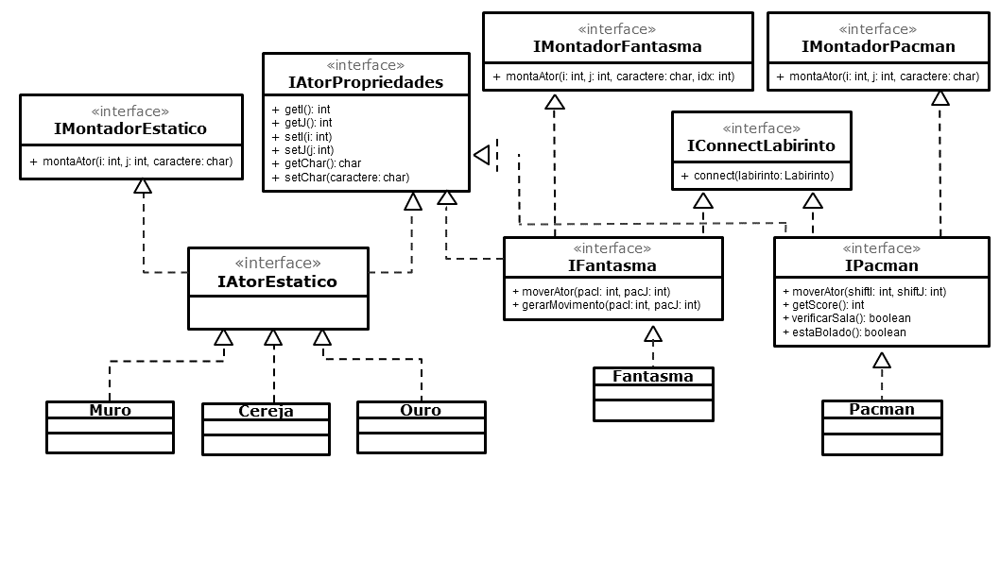

# Projeto `PAC-MAN`

# Estrutura de Arquivos e Pastas

~~~
├── README.md          <- apresentação do projeto
│
├── data               <- dados usados pelo jogo (se houver)
│
├── notebooks          <- Jupyter notebooks ou equivalentes
│
├── src                <- projeto em Java (preferencialmente projeto no Eclipse)
│   │
│   ├── src            <- arquivos-fonte do projeto (.java)
│   │
│   ├── bin            <- arquivos em bytecode (.class)
│   │
│   └── README.md      <- instruções básicas de instalação/execução
│
└── assets             <- mídias usadas no projeto
~~~

# Descrição Resumida do Projeto/Jogo

# Equipe: Não Tem Como
* `César Devens Grazioti` - `RA: 195641`
* `Cícero Pizzol Libardi` - `RA: 168810`

# Vídeos do Projeto

## Vídeo da Prévia

# Slides do Projeto

## Slides da Prévia
[Link dos slides da prévia](https://unicampbr-my.sharepoint.com/:p:/r/personal/c195641_m_unicamp_br/Documents/Pr%C3%A9via%20Pac-man%20-%20POO.pptx?d=wae4c790d8be24e2a91b3b25c6607d748&csf=1&web=1&e=FY9JLZ)

# Documentação dos Componentes

# Diagramas

## Diagrama Geral do Projeto

> Inicialmente, é criado um objeto do tipo Controle que, segundo sua metodologia, permite o fluxo do jogo na aplicação principal. Desse modo, o Controle instancia um objeto Montador, que por meio do contrato IMontador, oferece o serviço de criação do jogo. O objeto Montador, então, declara uma referência para um Labirinto com linhas × colunas Salas nulas, bem como para um Pacman e 4 Fantasmas, em forma de vetor. 
De acordo com a dificuldade selecionada pelo jogador, o Montador recebe do CSVHandling uma matriz de String. Para cada posição dessa matriz é instanciado um Ator, dependendo do caractere que a corresponde. Essa instância pode ser firmada pelas seguintes interfaces: IAtorEstatico, IFantasma, IPacman. Independentemente do tipo de instanciação, devemos conectar o Ator na  Sala pertencente à posição ij do labirinto, uma vez que o labirinto deve ter ciência de suas células. Essa conexão se dá por meio da interface IMontadorLabirinto.
 Caso o Ator instanciado anteriormente seja um Pacman ou um Fantasma, teremos uma conexão de via dupla, isto é, este Ator possui também uma referência para o tabuleiro - conforme acordado pela interface IConnectLabirinto.

> Dado que a execução do jogo se dá no Controle, devemos conectar o Labirinto, o Pacman e o vetor de Fantasma (instanciados no Montador) ao devido ponteiro declarado nos atributos do objeto Controle. Quem é responsável por essas 3 conexões é a interface IRMontador.
Note que o Controle tem referência dos Fantasmas e do Pacman pois é nele que o movimento desses atores é gerenciado.
Isto é: dada uma instrução de movimentação do usuário para o Pacman, o Controle pergunta ao Labirinto se tal movimento é válido, por intermédio da interface IMovimentoValido. Em caso afirmativo, o Ator (Pacman) atualiza sua nova posição no tabuleiro, via conexão IAtualizaTabuleiro. Por conseguinte, é pedido que a interface gráfica seja atualizada, ou seja, seja mostrado estado atual do tabuleiro - serviço disponibilizado pelo componente LabirintoView e definido pela interface IAtualizaView.

## Diagrama Geral de Componentes

## Componente `Labirinto`

> <Resumo do papel do componente e serviços que ele oferece.>

**Ficha Técnica**
item | detalhamento
----- | -----
Classe | `src.Labirinto`
Autores | `César Devens Grazioti` e `Cícero Pizzol Libardi`
Interfaces | `IMontadorLabirinto`, `IConnectLabirinto`, `IAtualizaLabirinto`, `IMovimentoValido`

### Interfaces

Interfaces associadas a esse componente:

Interface agregadora do componente em Java:

~~~java
public interface ILabirinto extends ILabirintoPropriedades, IAtualizaLabirinto, IMovimentoValido, IMontadorLabirinto{
}
~~~

## Detalhamento das Interfaces

### Interface `IMontadorLabirinto`

`<Resumo do papel da interface.>`

~~~
<Interface em Java.>
~~~

Método | Objetivo
-------| --------
`<id do método em Java>` | `<objetivo do método e descrição dos parâmetros>`

### Interface `IAtualizaLabirinto`

`<Resumo do papel da interface.>`

~~~
<Interface em Java.>
~~~

Método | Objetivo
-------| --------
`<id do método em Java>` | `<objetivo do método e descrição dos parâmetros>`

### Interface `IMovimentoValido`

`<Resumo do papel da interface.>`

~~~
<Interface em Java.>
~~~

Método | Objetivo
-------| --------
`<id do método em Java>` | `<objetivo do método e descrição dos parâmetros>`

### Interface `ILabirintoPropriedades`

`<Resumo do papel da interface.>`

~~~
<Interface em Java.>
~~~

Método | Objetivo
-------| --------
`<id do método em Java>` | `<objetivo do método e descrição dos parâmetros>`

### Interface `ILabirinto`

`<Resumo do papel da interface.>`

~~~
<Interface em Java.>
~~~

Método | Objetivo
-------| --------
`<id do método em Java>` | `<objetivo do método e descrição dos parâmetros>`

## Componente `Ator`

> <Resumo do papel do componente e serviços que ele oferece.>

**Ficha Técnica**
item | detalhamento
----- | -----
Classe | `src.Ator`
Autores | `César Devens Grazioti` e `Cícero Pizzol Libardi`
Interfaces | `IAtualizaLabirinto`, `IConnectLabirinto`, `IPacman`, `IFantasma`, `IMontadorEstatico`, `IMontadorPacman`, `IMontadorFantasma`

### Interfaces

Interfaces associadas a esse componente:

Interfaces agregadoras do componente em Java:

~~~java
public interface IAtorEstatico extends IAtorPropriedades, IMontadorAtor{
}
~~~

~~~java
public interface IFantasma extends IAtorPropriedades, IMontadorFantasma{
    public void moverAtor();
}
~~~

~~~java
public interface IPacman extends IAtorPropriedades, IMontadorPacman{
    public void moverAtor();
}
~~~

## Detalhamento das Interfaces

### Interface `IAtualizaLabirinto`

`<Resumo do papel da interface.>`

~~~
<Interface em Java.>
~~~

Método | Objetivo
-------| --------
`<id do método em Java>` | `<objetivo do método e descrição dos parâmetros>`

### Interface `IConnectLabirinto`

`<Resumo do papel da interface.>`

~~~
<Interface em Java.>
~~~

Método | Objetivo
-------| --------
`<id do método em Java>` | `<objetivo do método e descrição dos parâmetros>`

### Interface `IMontadorEstatico`

`<Resumo do papel da interface.>`

~~~
<Interface em Java.>
~~~

Método | Objetivo
-------| --------
`<id do método em Java>` | `<objetivo do método e descrição dos parâmetros>`

### Interface `IMontadorPacman`

`<Resumo do papel da interface.>`

~~~
<Interface em Java.>
~~~

Método | Objetivo
-------| --------
`<id do método em Java>` | `<objetivo do método e descrição dos parâmetros>`

### Interface `IMontadorFantasma`

`<Resumo do papel da interface.>`

~~~
<Interface em Java.>
~~~

Método | Objetivo
-------| --------
`<id do método em Java>` | `<objetivo do método e descrição dos parâmetros>`

### Interface `IPacman`

`<Resumo do papel da interface.>`

~~~
<Interface em Java.>
~~~

Método | Objetivo
-------| --------
`<id do método em Java>` | `<objetivo do método e descrição dos parâmetros>`

### Interface `IFantasma`

`<Resumo do papel da interface.>`

~~~
<Interface em Java.>
~~~

Método | Objetivo
-------| --------
`<id do método em Java>` | `<objetivo do método e descrição dos parâmetros>`

## Componente `Controle`

> <Resumo do papel do componente e serviços que ele oferece.>

**Ficha Técnica**
item | detalhamento
----- | -----
Classe | `src.Controle`
Autores | `César Devens Grazioti` e `Cícero Pizzol Libardi`
Interfaces | `IPacman`, `IFantasma`, `IMontador`, `IAtualizaView`, `IMovimentoValido`

### Interfaces

Interfaces associadas a esse componente:

Interface agregadora do componente em Java:

~~~java
public interface IControle extends IRMontador{
    public void executaJogo();
}
~~~

## Detalhamento das Interfaces

### Interface `IRMontador`

`<Resumo do papel da interface.>`

~~~
<Interface em Java.>
~~~

Método | Objetivo
-------| --------
`<id do método em Java>` | `<objetivo do método e descrição dos parâmetros>`

## Componente `Montador`

> <Resumo do papel do componente e serviços que ele oferece.>

**Ficha Técnica**
item | detalhamento
----- | -----
Classe | `src.Montador`
Autores | `César Devens Grazioti` e `Cícero Pizzol Libardi`
Interfaces | `IMontadorEstatico`, `IMontadorPacman`, `IMontadorFantasma`, `IMontadorLabirinto`, `IMontador`

### Interfaces

Interfaces associadas a esse componente:

Interface agregadora do componente em Java:

~~~java
public interface IMontador {
    public void criaJogo(IControle controle);
}
~~~

## Detalhamento das Interfaces

### Interface `IMontador`

`<Resumo do papel da interface.>`

~~~
<Interface em Java.>
~~~

Método | Objetivo
-------| --------
`<id do método em Java>` | `<objetivo do método e descrição dos parâmetros>`
